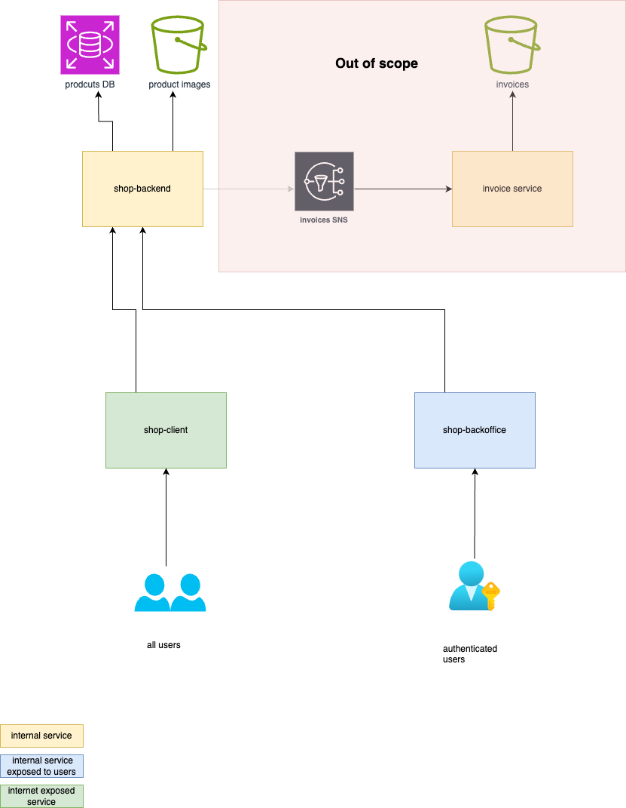

# Welcome to the wing shop!

This is a small demo app that consists of 3 services, a db and a bucket:



## Running locally:

_prerequisites:_

- node js
- terraform
- aws cli configured

To set up a dev environment please run:

```
npm run setup-dev
```

This will install dependencies, deploy an s3 bucket, and a postgres RDS to aws, to be used with the local servers, create a pre-populated .env file in the api servers, and fill the s3 and db with some initial information :tada:.

then to start the services please run:

`npm run start:all` to start them all.

OR you can start them one by one, by running:

- `npm run start:api` to start the api server (to access the data on the db by a front end service).
- `npm run start:bo` to start the back office panel (where admins can edit the products we sell).
- `npm run start:client` to start the shop client (where customers can review our products and "purchase" them).

**ports:**

- shop admin panel runs on `localhost:3001`
- shop client runs on `localhost:3000`
- api server runs on `localhost:8081`

## Deploying to the cloud:

//TBD
